# LLM Cascading: The $500 Million Wake-Up Call Every Enterprise Needed

> *Why intelligent routing is the most impactful AI cost and sustainability decision your enterprise isn't making yet — and the research, incidents, and architecture that prove it.*

**Nipun David** · Enterprise AI · Infrastructure · Sustainability  
[linkedin.com/in/nipundavid](https://linkedin.com/in/nipundavid)  
*Enterprise AI · Infrastructure · Sustainability · June 2026*

---

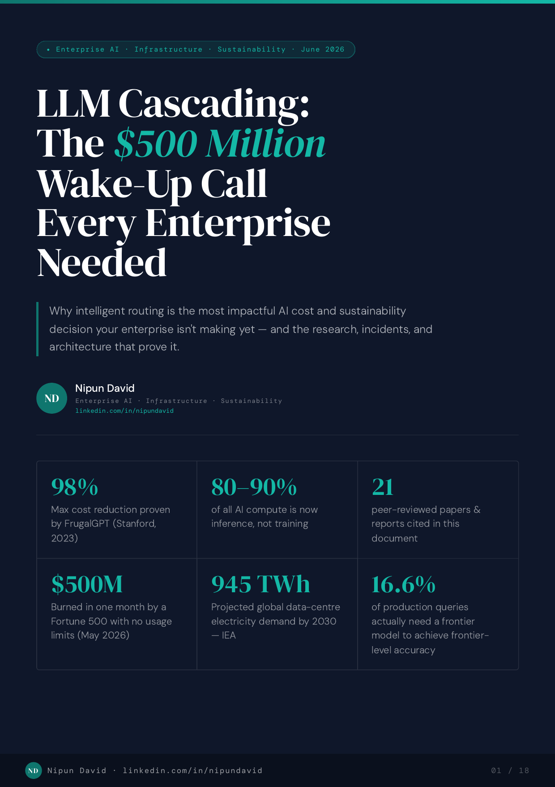

| Stat | Detail |
|------|--------|
| **98%** | Max cost reduction proven by FrugalGPT (Stanford, 2023) |
| **80–90%** | of all AI compute is now inference, not training |
| **21** | peer-reviewed papers & reports cited in this document |
| **$500M** | Burned in one month by a Fortune 500 with no usage limits (May 2026) |
| **945 TWh** | Projected global data-centre electricity demand by 2030 — IEA |
| **16.6%** | of production queries actually need a frontier model to achieve frontier-level accuracy |

---

## 01 · The Breaking Point: The Bill No One Budgeted For

The AI cost reckoning arrived faster than anyone expected. In the span of just a few months, a string of headline incidents illustrated what happens when enterprise AI deployments run without guardrails, routing intelligence, or developer education.

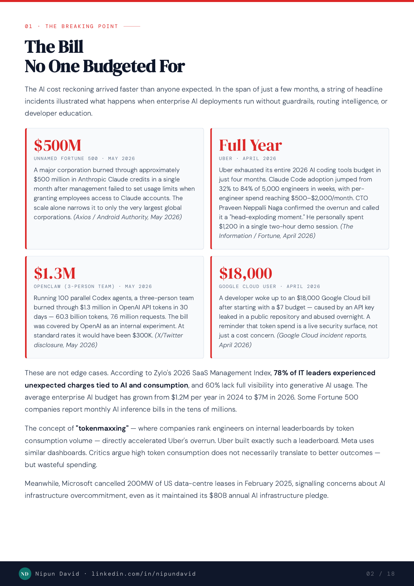

### Incidents

**$500M — Unnamed Fortune 500 · May 2026**  
A major corporation burned through approximately $500 million in Anthropic Claude credits in a single month after management failed to set usage limits when granting employees access to Claude accounts. The scale alone narrows it to only the very largest global corporations. *(Axios / Android Authority, May 2026)*

**Full Year Budget — Uber · April 2026**  
Uber exhausted its entire 2026 AI coding tools budget in just four months. Claude Code adoption jumped from 32% to 84% of 5,000 engineers in weeks, with per-engineer spend reaching $500–$2,000/month. CTO Praveen Neppalli Naga confirmed the overrun and called it a "head-exploding moment." He personally spent $1,200 in a single two-hour demo session. *(The Information / Fortune, April 2026)*

**$1.3M — OpenClaw (3-person team) · May 2026**  
Running 100 parallel Codex agents, a three-person team burned through $1.3 million in OpenAI API tokens in 30 days — 60.3 billion tokens, 7.6 million requests. The bill was covered by OpenAI as an internal experiment. At standard rates it would have been $300K. *(X/Twitter disclosure, May 2026)*

**$18,000 — Google Cloud User · April 2026**  
A developer woke up to an $18,000 Google Cloud bill after starting with a $7 budget — caused by an API key leaked in a public repository and abused overnight. A reminder that token spend is a live security surface, not just a cost concern. *(Google Cloud incident reports, April 2026)*

---

These are not edge cases. According to Zylo's 2026 SaaS Management Index, **78% of IT leaders experienced unexpected charges tied to AI and consumption**, and 60% lack full visibility into generative AI usage. The average enterprise AI budget has grown from $1.2M per year in 2024 to $7M in 2026. Some Fortune 500 companies report monthly AI inference bills in the tens of millions.

The concept of **"tokenmaxxing"** — where companies rank engineers on internal leaderboards by token consumption volume — directly accelerated Uber's overrun. Uber built exactly such a leaderboard. Meta uses similar dashboards. Critics argue high token consumption does not necessarily translate to better outcomes — but wasteful spending.

Meanwhile, Microsoft cancelled 200MW of US data-centre leases in February 2025, signalling concerns about AI infrastructure overcommitment, even as it maintained its $80B annual AI infrastructure pledge.

---

## 02 · Environmental Reality: The Inference Energy Crisis That Deserves Far More Attention

Most conversations about AI's environmental footprint focus on training. The numbers are dramatic — training a large model can emit hundreds of tonnes of CO₂ equivalent. But training happens once. Inference happens billions of times a day. And inference is where the real operational footprint now lives.

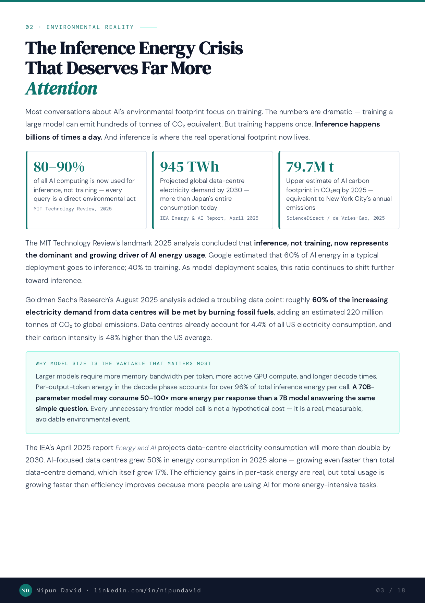

| Metric | Value | Source |
|--------|-------|--------|
| AI computing used for inference | **80–90%** | MIT Technology Review, 2025 |
| Projected global data-centre electricity demand by 2030 | **945 TWh** | IEA Energy & AI Report, April 2025 |
| Upper estimate of AI carbon footprint in CO₂eq by 2025 | **79.7M tonnes** | ScienceDirect / de Vries-Gao, 2025 |

The MIT Technology Review's landmark 2025 analysis concluded that inference, not training, now represents the dominant and growing driver of AI energy usage. Google estimated that 60% of AI energy in a typical deployment goes to inference; 40% to training. As model deployment scales, this ratio continues to shift further toward inference.

Goldman Sachs Research's August 2025 analysis added a troubling data point: roughly 60% of the increasing electricity demand from data centres will be met by burning fossil fuels, adding an estimated 220 million tonnes of CO₂ to global emissions. Data centres already account for 4.4% of all US electricity consumption, and their carbon intensity is 48% higher than the US average.

### Why Model Size Is the Variable That Matters Most

Larger models require more memory bandwidth per token, more active GPU compute, and longer decode times. Per-output-token energy in the decode phase accounts for over 96% of total inference energy per call. **A 70B-parameter model may consume 50–100× more energy per response than a 7B model answering the same simple question.** Every unnecessary frontier model call is not a hypothetical cost — it is a real, measurable, avoidable environmental event.

The IEA's April 2025 report *Energy and AI* projects data-centre electricity consumption will more than double by 2030. AI-focused data centres grew 50% in energy consumption in 2025 alone — growing even faster than total data-centre demand, which itself grew 17%. The efficiency gains in per-task energy are real, but total usage is growing faster than efficiency improves because more people are using AI for more energy-intensive tasks.

---

## 03 · The Solution: What LLM Cascading Actually Is

LLM cascading is a tiered routing strategy: each query is dispatched to the smallest model capable of answering it with sufficient confidence. Only queries that fall below a confidence threshold escalate to a more capable — and more expensive — tier. The frontier model is the last resort, not the default.

The architecture was formalised and validated by the landmark **FrugalGPT** paper from Stanford (Chen, Zaharia & Zou, 2023, arXiv:2305.05176), and extended by the open-source **RouteLLM** framework from UC Berkeley, Anyscale, and Canva (Ong et al., July 2024, arXiv:2406.18665).

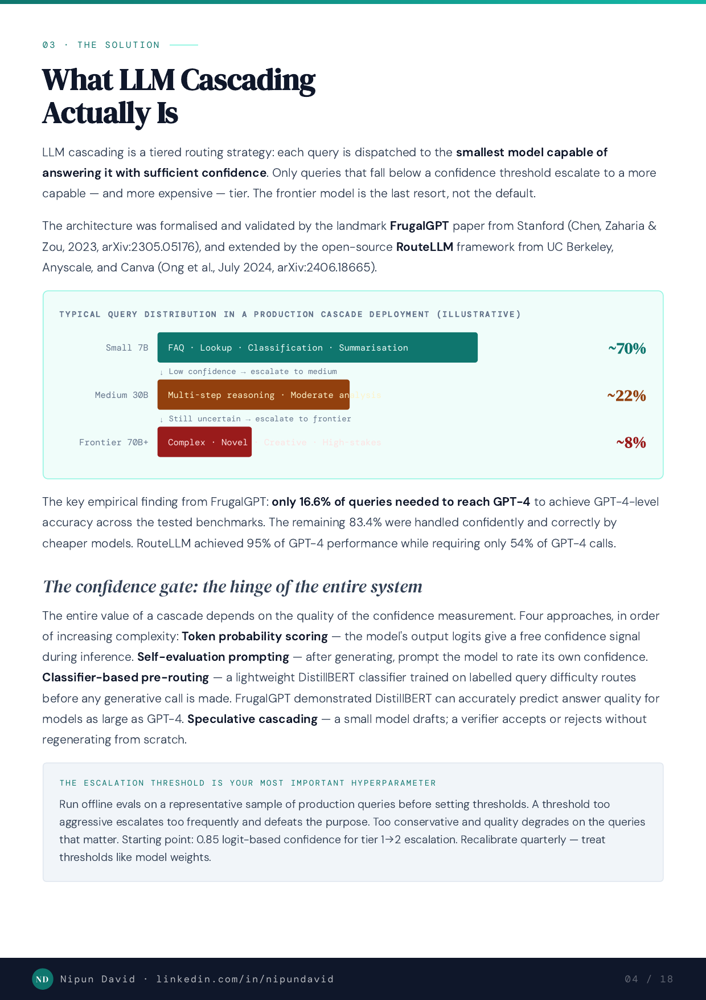

### Typical Query Distribution in a Production Cascade Deployment (Illustrative)

```
Small 7B   — FAQ · Lookup · Classification · Summarisation   ~70%
    ↓ Low confidence → escalate to medium
Medium 30B — Multi-step reasoning · Moderate analysis        ~22%
    ↓ Still uncertain → escalate to frontier
Frontier 70B+ — Complex · Novel · Creative · High-stakes    ~8%
```

The key empirical finding from FrugalGPT: **only 16.6% of queries needed to reach GPT-4** to achieve GPT-4-level accuracy across the tested benchmarks. The remaining 83.4% were handled confidently and correctly by cheaper models. RouteLLM achieved 95% of GPT-4 performance while requiring only 54% of GPT-4 calls.

### The Confidence Gate: The Hinge of the Entire System

The entire value of a cascade depends on the quality of the confidence measurement. Four approaches, in order of increasing complexity:

1. **Token probability scoring** — the model's output logits give a free confidence signal during inference.
2. **Self-evaluation prompting** — after generating, prompt the model to rate its own confidence.
3. **Classifier-based pre-routing** — a lightweight DistillBERT classifier trained on labelled query difficulty routes before any generative call is made. FrugalGPT demonstrated DistillBERT can accurately predict answer quality for models as large as GPT-4.
4. **Speculative cascading** — a small model drafts; a verifier accepts or rejects without regenerating from scratch.

> **The escalation threshold is your most important hyperparameter.** Run offline evals on a representative sample of production queries before setting thresholds. Starting point: 0.85 logit-based confidence for tier 1→2 escalation. Recalibrate quarterly — treat thresholds like model weights.

---

## 04 · The Economics: The Real Cost Math — And Why It Gets Worse

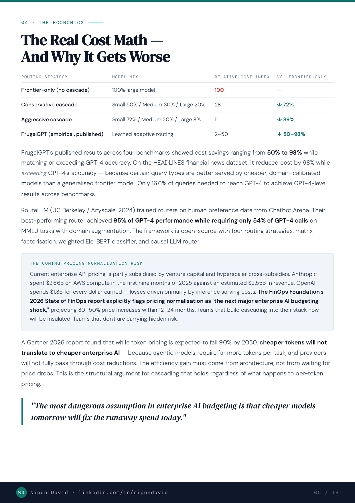

| Routing Strategy | Model Mix | Relative Cost Index | vs. Frontier-Only |
|---|---|---|---|
| Frontier-only (no cascade) | 100% large model | 100 | — |
| Conservative cascade | Small 50% / Medium 30% / Large 20% | 28 | ↓ 72% |
| Aggressive cascade | Small 72% / Medium 20% / Large 8% | 11 | ↓ 89% |
| FrugalGPT (empirical, published) | Learned adaptive routing | 2–50 | ↓ 50–98% |

FrugalGPT's published results across four benchmarks showed cost savings ranging from 50% to 98% while matching or exceeding GPT-4 accuracy. On the HEADLINES financial news dataset, it reduced cost by 98% while exceeding GPT-4's accuracy — because certain query types are better served by cheaper, domain-calibrated models than a generalised frontier model.

RouteLLM (UC Berkeley / Anyscale, 2024) trained routers on human preference data from Chatbot Arena. Their best-performing router achieved 95% of GPT-4 performance while requiring only 54% of GPT-4 calls on MMLU tasks with domain augmentation. The framework is open-source with four routing strategies: matrix factorisation, weighted Elo, BERT classifier, and causal LLM router.

### The Coming Pricing Normalisation Risk

Current enterprise API pricing is partly subsidised by venture capital and hyperscaler cross-subsidies. Anthropic spent $2.66B on AWS compute in the first nine months of 2025 against an estimated $2.55B in revenue. OpenAI spends $1.35 for every dollar earned — losses driven primarily by inference serving costs. The FinOps Foundation's 2026 State of FinOps report explicitly flags pricing normalisation as **"the next major enterprise AI budgeting shock,"** projecting 30–50% price increases within 12–24 months.

A Gartner 2026 report found that while token pricing is expected to fall 90% by 2030, cheaper tokens will not translate to cheaper enterprise AI — because agentic models require far more tokens per task, and providers will not fully pass through cost reductions. **The efficiency gain must come from architecture, not from waiting for price drops.**

> *"The most dangerous assumption in enterprise AI budgeting is that cheaper models tomorrow will fix the runaway spend today."*

---

## 05 · Developer Education: The Overlooked Problem

Technology alone will not solve this. The more fundamental issue is that developers — and the organisations that incentivise them — have not internalised a basic principle: **not every query requires an LLM at all**, let alone a frontier reasoning model.

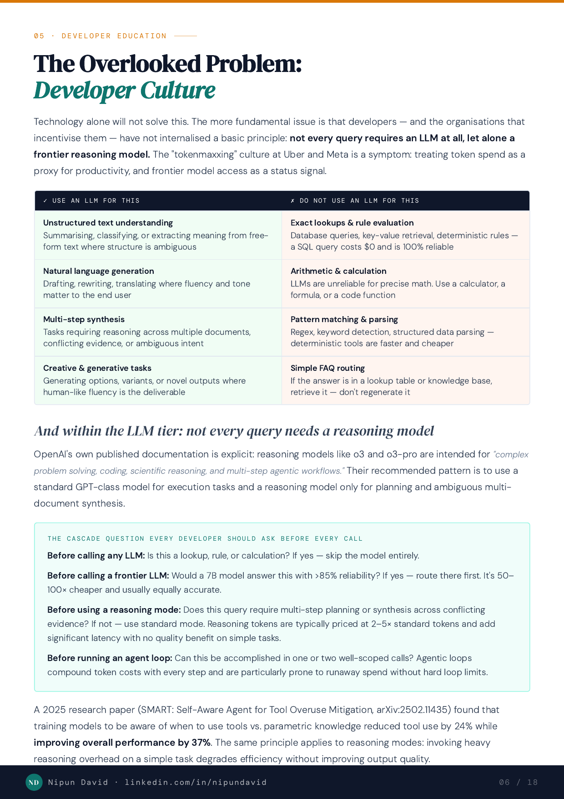

### When to Use (and Not Use) an LLM

| ✓ USE AN LLM FOR THIS | ✗ DO NOT USE AN LLM FOR THIS |
|---|---|
| **Unstructured text understanding** — summarising, classifying, or extracting meaning from freeform text | **Exact lookups & rule evaluation** — database queries, key-value retrieval, deterministic rules (SQL costs $0 and is 100% reliable) |
| **Natural language generation** — drafting, rewriting, translating where fluency and tone matter | **Arithmetic & calculation** — LLMs are unreliable for precise math; use a calculator or code function |
| **Multi-step synthesis** — reasoning across multiple documents, conflicting evidence, or ambiguous intent | **Pattern matching & parsing** — regex, keyword detection, structured data parsing |
| **Creative & generative tasks** — generating options, variants, or novel outputs | **Simple FAQ routing** — if the answer is in a lookup table or knowledge base, retrieve it, don't regenerate it |

### The Cascade Question Every Developer Should Ask Before Every Call

- **Before calling any LLM:** Is this a lookup, rule, or calculation? If yes — skip the model entirely.
- **Before calling a frontier LLM:** Would a 7B model answer this with >85% reliability? If yes — route there first. It's 50–100× cheaper and usually equally accurate.
- **Before using a reasoning mode:** Does this query require multi-step planning or synthesis across conflicting evidence? If not — use standard mode. Reasoning tokens are typically priced at 2–5× standard tokens.
- **Before running an agent loop:** Can this be accomplished in one or two well-scoped calls? Agentic loops compound token costs with every step.

A 2025 research paper (SMART: Self-Aware Agent for Tool Overuse Mitigation, arXiv:2502.11435) found that training models to be aware of when to use tools vs. parametric knowledge **reduced tool use by 24% while improving overall performance by 37%**.

---

## 06 · Enterprise Playbook: Implementing Cascading in an Enterprise

Moving from single-model deployment to a governed cascade is a multi-layered change — technical, organisational, and cultural. Here is a practical seven-step roadmap.

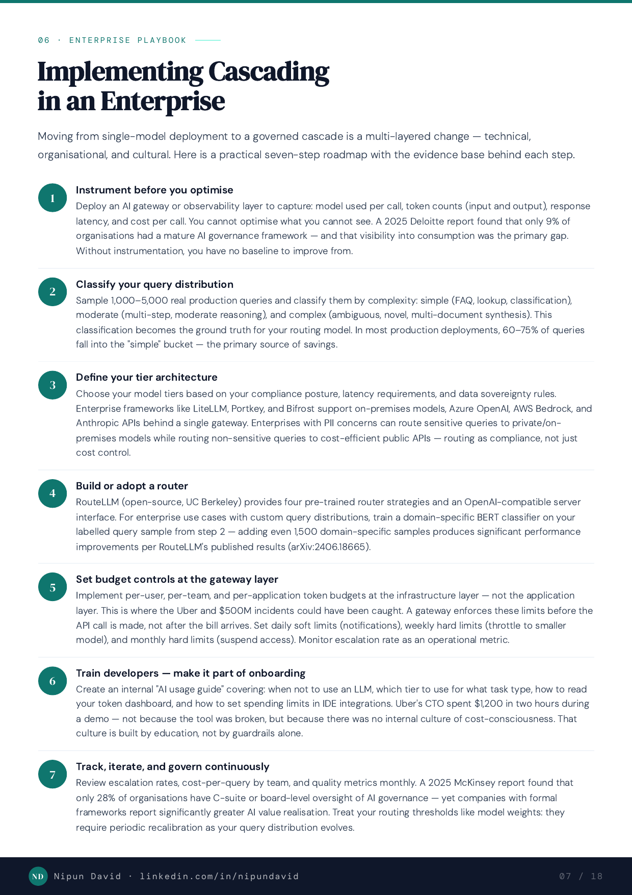

### Step 1 — Instrument Before You Optimise
Deploy an AI gateway or observability layer to capture: model used per call, token counts (input and output), response latency, and cost per call. A 2025 Deloitte report found that only 9% of organisations had a mature AI governance framework — and that visibility into consumption was the primary gap.

### Step 2 — Classify Your Query Distribution
Sample 1,000–5,000 real production queries and classify them by complexity: simple, moderate, and complex. In most production deployments, **60–75% of queries fall into the "simple" bucket** — the primary source of savings.

### Step 3 — Define Your Tier Architecture
Choose your model tiers based on compliance posture, latency requirements, and data sovereignty rules. Enterprise frameworks like LiteLLM, Portkey, and Bifrost support on-premises models, Azure OpenAI, AWS Bedrock, and Anthropic APIs behind a single gateway.

### Step 4 — Build or Adopt a Router
RouteLLM (open-source, UC Berkeley) provides four pre-trained router strategies and an OpenAI-compatible server interface. For enterprise use cases with custom query distributions, train a domain-specific BERT classifier on your labelled query sample from Step 2.

### Step 5 — Set Budget Controls at the Gateway Layer
Implement per-user, per-team, and per-application token budgets at the **infrastructure layer** — not the application layer. This is where the Uber and $500M incidents could have been caught. Set:
- **Daily soft limits** (notifications)
- **Weekly hard limits** (throttle to smaller model)
- **Monthly hard limits** (suspend access)

### Step 6 — Train Developers — Make It Part of Onboarding
Create an internal "AI usage guide" covering: when not to use an LLM, which tier to use for what task type, how to read your token dashboard, and how to set spending limits in IDE integrations.

### Step 7 — Track, Iterate, and Govern Continuously
Review escalation rates, cost-per-query by team, and quality metrics monthly. A 2025 McKinsey report found that only 28% of organisations have C-suite or board-level oversight of AI governance. Treat your routing thresholds like model weights: they require periodic recalibration.

---

## 07 · The Ecosystem: The Tools Available Today

The cascading infrastructure stack is mature, well-researched, and largely open-source. Most enterprises are not using it.

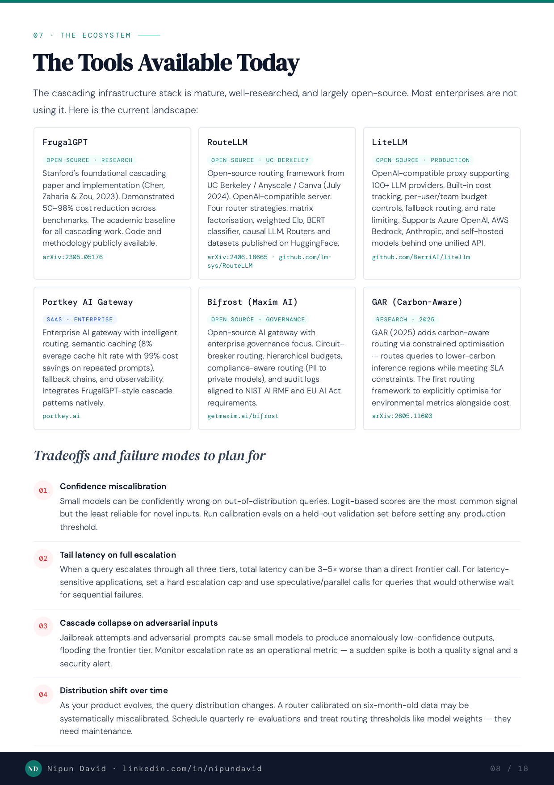

| Tool | Type | Description |
|------|------|-------------|
| **FrugalGPT** | Open Source · Research | Stanford's foundational cascading paper and implementation (Chen, Zaharia & Zou, 2023). 50–98% cost reduction across benchmarks. [arXiv:2305.05176](https://arxiv.org/abs/2305.05176) |
| **RouteLLM** | Open Source · UC Berkeley | Open-source routing framework from UC Berkeley / Anyscale / Canva (July 2024). OpenAI-compatible server. Four router strategies. [arXiv:2406.18665](https://arxiv.org/abs/2406.18665) · [github.com/lmsys/RouteLLM](https://github.com/lmsys/RouteLLM) |
| **LiteLLM** | Open Source · Production | OpenAI-compatible proxy supporting 100+ LLM providers. Built-in cost tracking, per-user/team budget controls, fallback routing, and rate limiting. [github.com/BerriAI/litellm](https://github.com/BerriAI/litellm) |
| **Portkey AI Gateway** | SaaS · Enterprise | Enterprise AI gateway with intelligent routing, semantic caching (8% average cache hit rate with 99% cost savings on repeated prompts), fallback chains, and observability. [portkey.ai](https://portkey.ai) |
| **Bifrost (Maxim AI)** | Open Source · Governance | Open-source AI gateway with enterprise governance focus. Circuit-breaker routing, hierarchical budgets, compliance-aware routing (PII to private models), and audit logs aligned to NIST AI RMF and EU AI Act. [getmaxim.ai/bifrost](https://getmaxim.ai/bifrost) |
| **GAR (Carbon-Aware)** | Research · 2025 | Adds carbon-aware routing via constrained optimisation — routes queries to lower-carbon inference regions while meeting SLA constraints. [arXiv:2605.11603](https://arxiv.org/abs/2605.11603) |

### Tradeoffs and Failure Modes to Plan For

1. **Confidence miscalibration** — Small models can be confidently wrong on out-of-distribution queries. Run calibration evals on a held-out validation set before setting any production threshold.
2. **Tail latency on full escalation** — When a query escalates through all three tiers, total latency can be 3–5× worse than a direct frontier call. Set a hard escalation cap for latency-sensitive applications.
3. **Cascade collapse on adversarial inputs** — Jailbreak attempts cause small models to produce anomalously low-confidence outputs, flooding the frontier tier. Monitor escalation rate as an operational metric.
4. **Distribution shift over time** — As your product evolves, the query distribution changes. Schedule quarterly re-evaluations.
5. **Shadow AI defeating gateway controls** — 82% of organisations discovered an AI agent or workflow in the past year that IT did not previously know about. *(Cloud Security Alliance, 2026)*

---

## 08 · The Reasoning Trap: Reasoning Models Are Making Cascading More Important, Not Less

There is a widespread assumption circulating in engineering teams: that as models become more capable, the need for intelligent routing will diminish. **The data says the opposite is happening.** Smarter models are, on average, dramatically more expensive per query — not less.

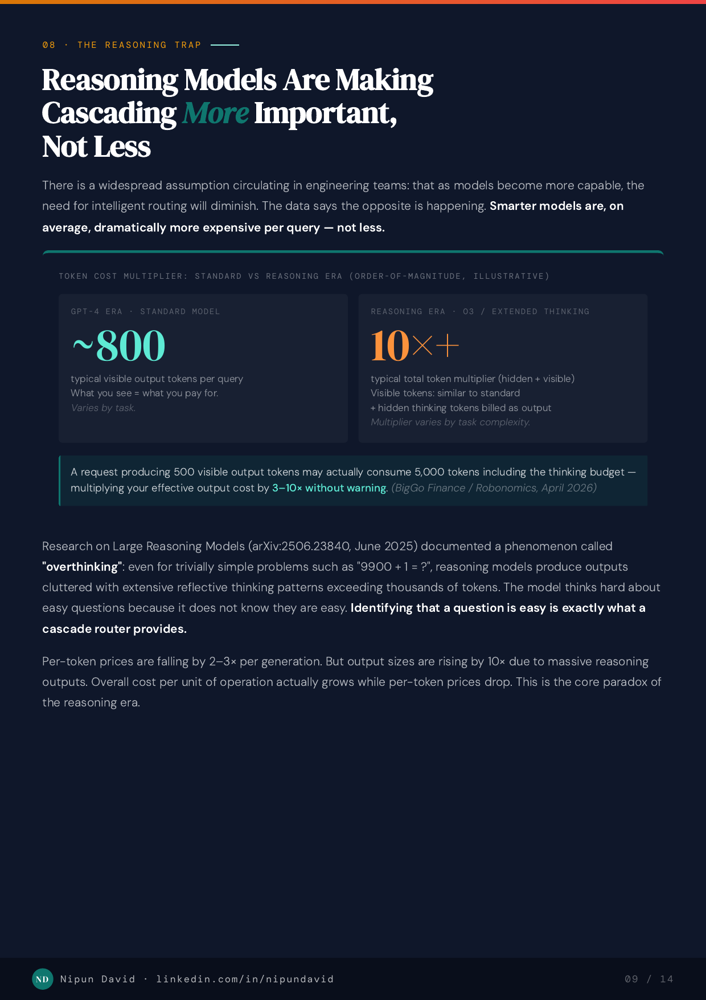

### Token Cost Multiplier: Standard vs Reasoning Era

| Era | Typical Output Tokens | What You Pay For |
|-----|---|---|
| **GPT-4 Era · Standard Model** | ~800 visible output tokens per query | What you see = what you pay for |
| **Reasoning Era · o3 / Extended Thinking** | 10×+ total token multiplier (hidden + visible) | Visible tokens similar to standard + hidden thinking tokens billed as output |

A request producing 500 visible output tokens may actually consume 5,000 tokens including the thinking budget — multiplying your effective output cost by **3–10× without warning.** *(BigGo Finance / Robonomics, April 2026)*

Research on Large Reasoning Models (arXiv:2506.23840, June 2025) documented a phenomenon called **"overthinking"**: even for trivially simple problems such as "9900 + 1 = ?", reasoning models produce outputs cluttered with extensive reflective thinking patterns exceeding thousands of tokens. The model thinks hard about easy questions because it does not know they are easy. **Identifying that a question is easy is exactly what a cascade router provides.**

Per-token prices are falling by 2–3× per generation. But output sizes are rising by 10× due to massive reasoning outputs. Overall cost per unit of operation actually grows while per-token prices drop. This is the core paradox of the reasoning era.

---

## 08 (cont.) · Agentic Loops: Where Costs Grow Super-Linearly

When a reasoning model runs inside an agentic loop — planning steps, calling tools, evaluating results, deciding next actions — token costs can grow super-linearly because each iteration often carries forward an expanding context window.

> *"The strategic insight here is that one size does not fit all. A robust system must employ a routing pattern that classifies the complexity of an incoming query and routes it to the appropriate tier. Cheap and fast for simple queries. Deep and slow for complex ones."*  
> — Stevens Institute, Hidden Economics of AI Agents, January 2026

OpenAI's own documentation confirms the tiered model approach: *"Most AI workflows will use a combination of both models — o-series for agentic planning and decision-making, GPT-series for task execution."*

### The Cascade–Reasoning Interaction in Practice

| Query Type | Routing Decision |
|---|---|
| Simple queries | Route to small standard model. Sub-second, fraction of a cent. 99% cheaper than a reasoning call. |
| Moderate analysis | Route to medium standard model. Standard mode only — avoid o3-class. |
| Novel multi-step reasoning | Frontier reasoning model justified. Extended thinking enabled. |

Every generation, the small-model tier gets more capable for free. The frontier tier gets more powerful — and more expensive per task. Cascading captures the value of both without paying the premium of either by default.

---

## 09 · The Dual Benefit: Enterprise and Environment — The Same Decision

The sustainability case and the financial case are not in tension. They are the same case stated from different vantage points. If 70–80% of production queries are genuinely answerable by a small model, and each small-model call consumes 1/50th to 1/100th the energy of a frontier call, **a well-implemented cascade can reduce the inference carbon footprint of an enterprise AI deployment by 50–70% without any degradation in output quality.**

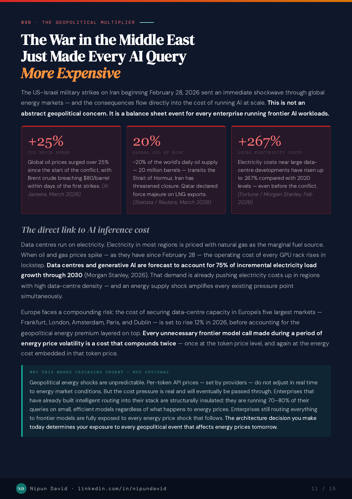

For enterprise sustainability reporting: As ESG disclosure requirements tighten globally — particularly under EU CSRD and SEC climate disclosure rules — AI inference emissions are becoming a material reporting item. Building cascading into your AI stack is also building your emissions measurement and control posture.

### From Cloud FinOps to AI FinOps

Enterprises have been here before. In the early years of cloud computing, teams provisioned compute the way they had provisioned on-premise hardware: always on, billed to a cost centre that rarely looked at the invoice. Gartner estimated organisations wasted 30–35% of cloud spend through overprovisioning. **AI is following the same arc, compressed into a shorter timeframe.**

| Cloud FinOps Tracked | AI FinOps Must Also Track |
|---|---|
| Cost per compute-hour | Cost per workflow (one workflow = many calls) |
| Resource utilisation rate | Frontier model utilisation rate |
| Cost per team / department | Cost per employee — with alert thresholds |
| Idle instance detection | Escalation rate monitoring |
| Carbon / PUE reporting | Carbon per inference — model tier × energy intensity × grid carbon factor |

None of these AI FinOps metrics exist by default in any provider's billing dashboard. They require instrumentation at the gateway layer — which is precisely where a cascade router already lives. **The team that builds its cascade also builds its AI FinOps observability for free.**

---

## 09B · The Geopolitical Multiplier: The War in the Middle East Just Made Every AI Query More Expensive

The US–Israel military strikes on Iran beginning February 28, 2026 sent an immediate shockwave through global energy markets — and the consequences flow directly into the cost of running AI at scale.

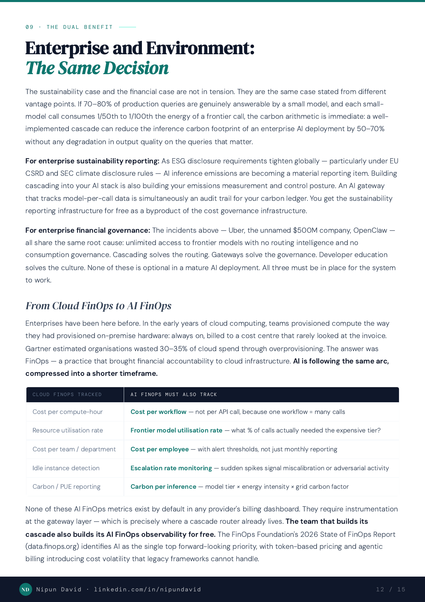

| Indicator | Value | Source |
|---|---|---|
| Oil price surge | **+25%** | Global oil prices surged over 25% since start of conflict; Brent crude breaching $80/barrel *(Al Jazeera, March 2026)* |
| Global oil at risk | **~20%** | ~20M barrels/day transits Strait of Hormuz; Iran has threatened closure; Qatar declared force majeure on LNG exports *(Statista / Reuters, March 2026)* |
| Local electricity cost increases | **+267%** | Electricity costs near large data-centre developments vs. 2020 levels — even before the conflict *(Fortune / Morgan Stanley, Feb 2026)* |

Data centres run on electricity. Electricity in most regions is priced with natural gas as the marginal fuel source. When oil and gas prices spike, the operating cost of every GPU rack rises in lockstep. Data centres and generative AI are forecast to account for **75% of incremental electricity load growth through 2030** *(Morgan Stanley, 2026)*.

> **Every unnecessary frontier model call made during a period of energy price volatility is a cost that compounds twice** — once at the token price level, and again at the energy cost embedded in that token price.

Enterprises that have already built intelligent routing into their stack are structurally insulated: they are running 70–80% of their queries on small, efficient models regardless of what happens to energy prices. **The architecture decision you make today determines your exposure to every geopolitical event that affects energy prices tomorrow.**

---

## 10 · The Central Argument

> *The smarter models become, the more important intelligent routing becomes.*

Every generation of AI models produces more capable, more expensive frontier options — and simultaneously produces cheaper, more capable small models. GPT-5 mini at $0.25/M input tokens is more capable today than GPT-4 was in 2023, when it cost $30/M tokens. The small-model tier of your cascade keeps getting better for free. The frontier tier keeps getting more powerful — and when used thoughtlessly, more expensive per task.

The gap between "capable enough for this query" and "most powerful available" is growing in both directions simultaneously — more capability at the bottom, more token consumption at the top. Cascading is the architecture that captures the value of both without paying the premium of either by default.

The sustainability argument and the cost argument converge on the same architectural decision. Routing queries intelligently — smallest sufficient model first, frontier model last — happens to be both the frugal choice and the responsible one. In a world where AI inference workloads are growing faster than the grid is decarbonising, that alignment matters.

> *"The most successful organisations will not be those with access to the most powerful models. They will be those that can determine when not to use them."*

The techniques are available now. FrugalGPT, RouteLLM, and a growing ecosystem of routing frameworks have made implementation tractable. The question for most teams is no longer *can we do this* — it is **why haven't we started yet.**

---

## References & Research

*21 peer-reviewed papers, institutional reports, and verified news sources.*

| Ref | Citation |
|-----|---------|
| R01 | Chen, Zaharia & Zou · **FrugalGPT: Reducing LLM Cost and Improving Performance** · Stanford · arXiv:2305.05176 · 2023 |
| R02 | Ong et al. · **RouteLLM: Learning to Route LLMs with Preference Data** · UC Berkeley / Anyscale · arXiv:2406.18665 · 2024 |
| R03 | **GAR: Carbon-Aware Routing for LLM Inference** · arXiv:2605.11603 · May 2025 |
| R04 | **How Hungry is AI? Benchmarking Energy & Carbon of LLM Inference** · arXiv:2505.09598 · May 2025 |
| R05 | **Energy Costs of Communicating with AI — CO₂ Across 14 LLMs** · Frontiers in Communication · fcomm.2025.1572947 · April 2025 |
| R06 | de Vries-Gao · **Carbon and Water Footprints of Data Centers and AI** · ScienceDirect / Joule · December 2025 |
| R07 | **AI's Energy Usage — Inference as the Dominant Driver** · MIT Technology Review · May 2025 |
| R08 | **Energy and AI — Data Centre Projection to 945 TWh by 2030** · International Energy Agency · iea.org/reports/energy-and-ai · 2025 |
| R09 | **Mystery Company Burned $500M on Claude in One Month** · Axios / Android Authority · May 2026 |
| R10 | **Uber Burns 2026 AI Budget in Four Months on Claude Code** · Fortune / The Information / AI Weekly · April–May 2026 |
| R11 | **Microsoft Cancels 200MW of AI Data Centre Leases** · TD Cowen / Data Centre Dynamics · February 2025 |
| R12 | **SMART: Self-Aware Agent for Tool Overuse Mitigation** · arXiv:2502.11435 · February 2025 |
| R13 | **OpenAI Reasoning Best Practices — When to Use o-Series** · platform.openai.com/docs/guides/reasoning · 2025 |
| R14 | **State of FinOps Report 2026 — AI as Top Priority** · FinOps Foundation · data.finops.org · 2026 |
| R15 | **Zylo 2026 SaaS Management Index — 78% Face Unexpected AI Charges** · Zylo · April 2026 |
| R16 | **AI Governance Best Practices — Only 9% Have Mature Governance** · Deloitte AI Adoption Trends Report · 2024 |
| R17 | **Do Thinking Tokens Help or Trap? Overthinking in LRMs** · arXiv:2506.23840 · June 2025 |
| R18 | **Hidden Economics of AI Agents: Token Costs and Latency** · Stevens Institute of Technology · January 2026 |
| R19 | **Thinking Tokens: Hidden Costs Can Multiply Bills 3–10x** · BigGo Finance / Robonomics · April 2026 |
| R20 | **AI Inference Cost Crisis 2026** · oplexa.com · March 2026 |
| R21 | **Uber COO: AI Spending Hard to Justify Without Clear ROI Link** · Yahoo Finance / Fortune · May 2026 |

---

*LLM Cascading: The $500M Wake-Up Call Every Enterprise Needed · June 2026 · 21 references*  
**Nipun David** · [linkedin.com/in/nipundavid](https://linkedin.com/in/nipundavid)
